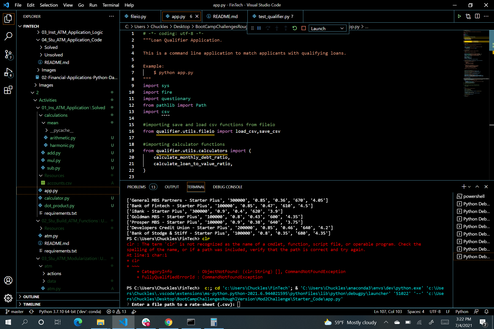
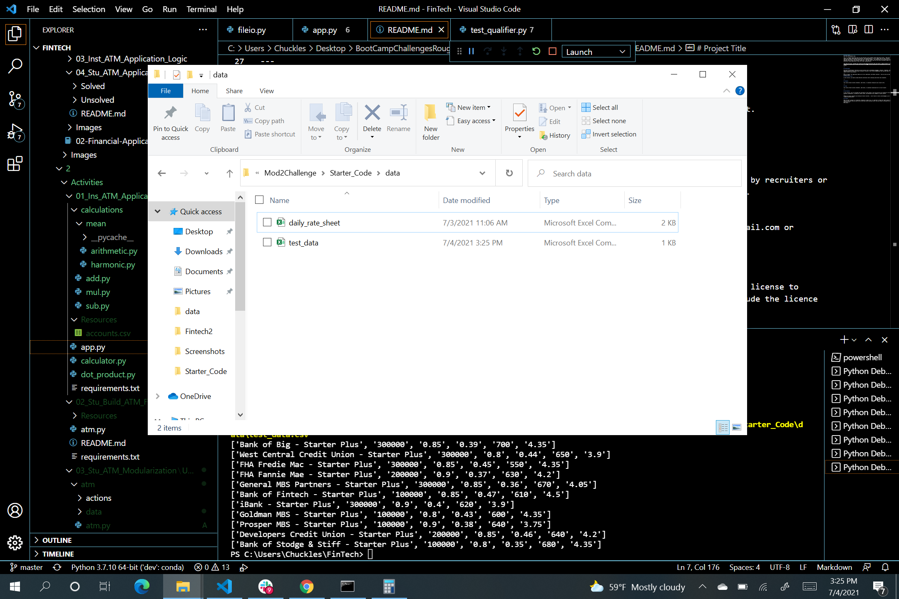
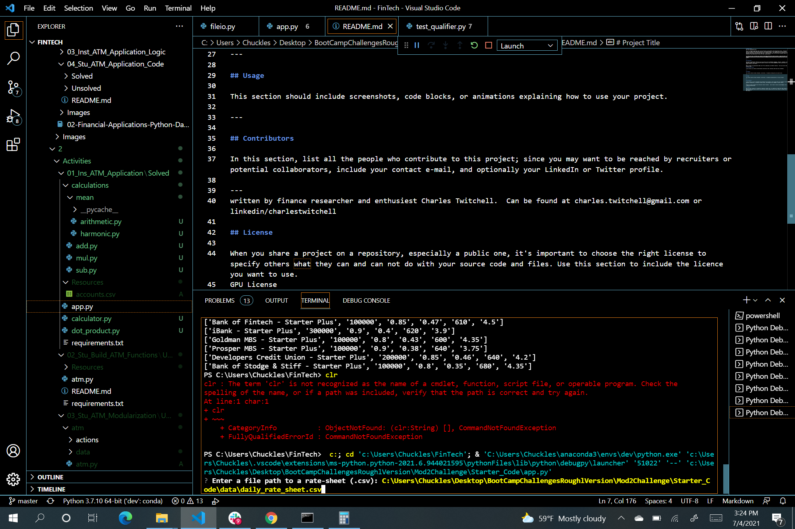
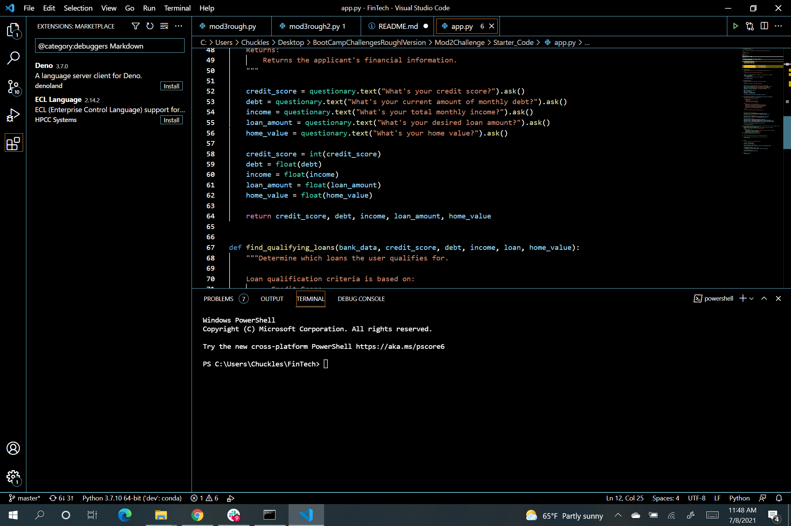
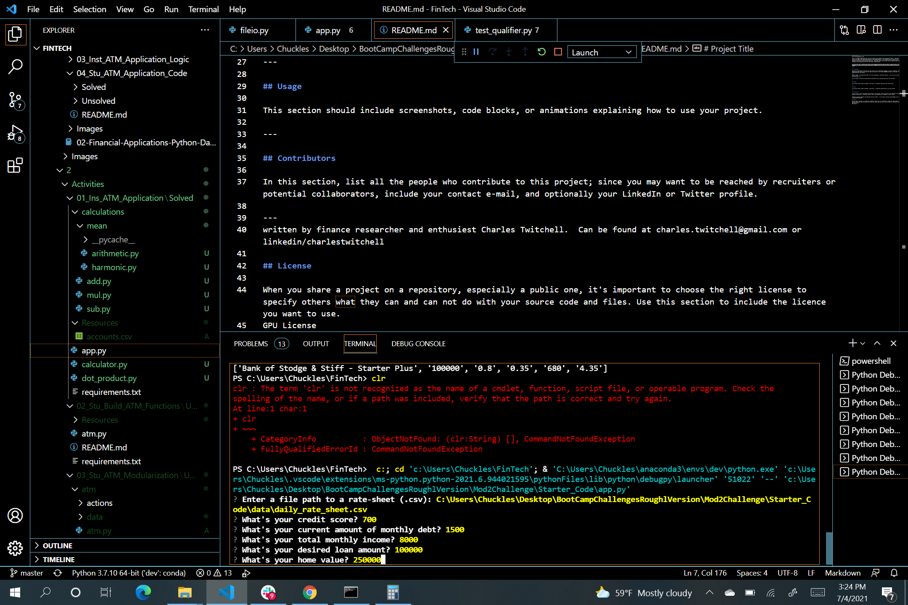
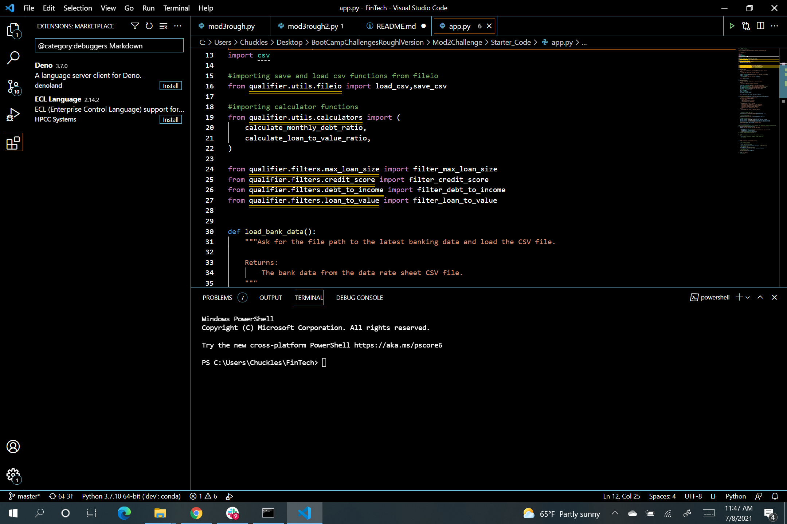
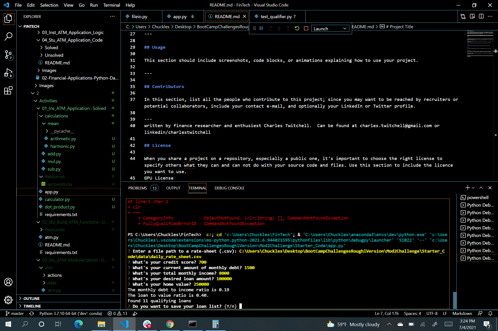
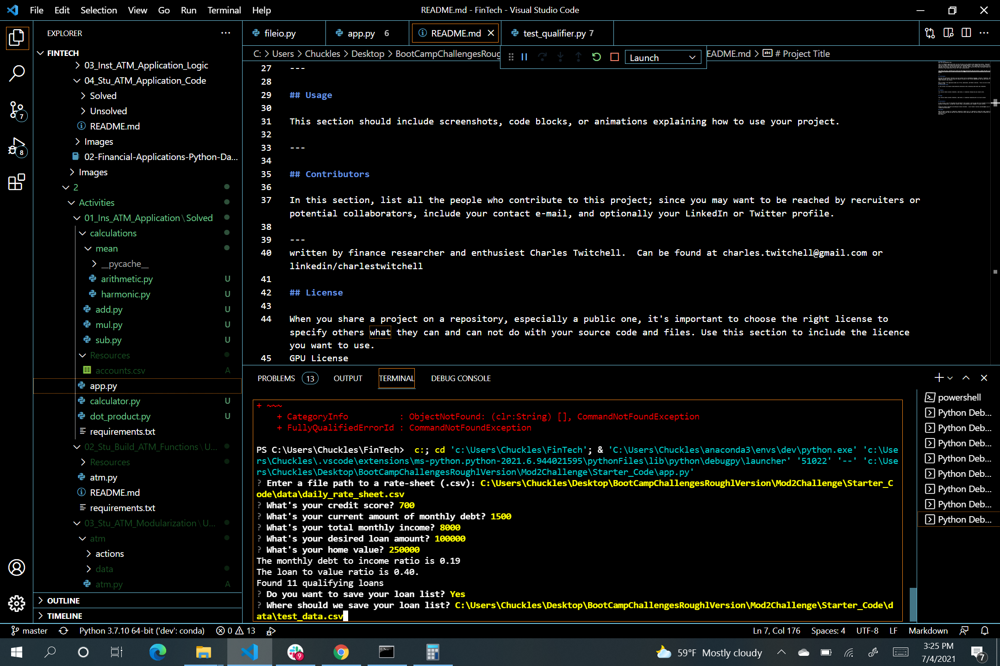

### Bank Loan Reccomendation App 

This is a framework application that can form the basis of any standard credit application process.  Applicants are asked a few common credit application questions, get matched against a list of lenders that fit their criteria, and then have the option to save and recieve the list of potential lenders.  

Application was created to give both lenders and users more flexibility to find suitable loans in a changing banking landscape.  This application can be scaled up to have modified credit citeria, more specific lenders etc.  This open source code can allow small and medium lenders and potentially crypto applications to get into credit lending quickly.

---

## Technologies
---
Built on Python, this application makes use of Fire, Questionary, and PyTest libraries.  Files must be read as a CSV.

## Installation Guide
---
This project requires in installation of several python packages as outline in the attached pic.  Packages include, sys, fire, questionary, Path, and CSV:

---

## Examples
---
A case example of a loan app loading a rate sheet from various lenders. You can have as meany lenders as you want.

Siomply tell the system what CSV file to load.

---

## Usage
---
Once the Daily Rate Sheet is loaded, the user goes through several steps:

Asked a Series of questions about their Credit using questionary:

System them modifies an appropriate list of lenders and prompts user if they would like to save the file:

User then enters the file directory to save their lender list as a CSV:

---

## Contributors
---
Written by finance researcher and enthusiest Charles Twitchell.  He can be found at [Linked In](https://www.linkedin.com/in/charlestwitchell/)

## License
---
GPU License